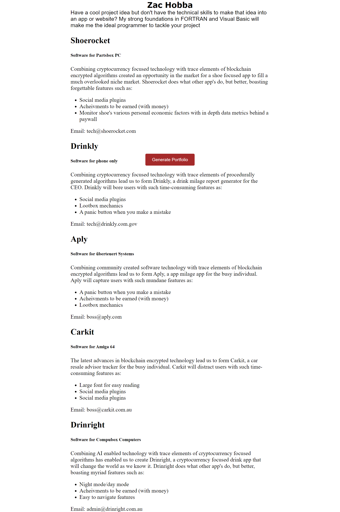

# Product-Generator-Website
This website at the moment allows the user to generate product ideas in the form of a resume experience entry.

### Current version

### Link
Go to the [Website link](https://hobbaz.github.io/Product-Generator-Website/)

### How to use
Wait for the site to generate product ideas then click red button to generate more ideas.

### Issues
Sometimes the features section will repeat

### Technology Used
- HTML
- CSS
- Javascript

## Future ideas
- Add generated images
- Refine colour scheme and layout

### MIT License
Permission is hereby granted, free of charge, to any person obtaining a copy of this software and associated documentation files (the "Software"), to deal in the Software without restriction, including without limitation the rights to use, copy, modify, merge, publish, distribute, sublicense, and/or sell copies of the Software, and to permit persons to whom the Software is furnished to do so, subject to the following conditions:

The above copyright notice and this permission notice shall be included in all copies or substantial portions of the Software.

THE SOFTWARE IS PROVIDED "AS IS", WITHOUT WARRANTY OF ANY KIND, EXPRESS OR IMPLIED, INCLUDING BUT NOT LIMITED TO THE WARRANTIES OF MERCHANTABILITY, FITNESS FOR A PARTICULAR PURPOSE AND NONINFRINGEMENT. IN NO EVENT SHALL THE AUTHORS OR COPYRIGHT HOLDERS BE LIABLE FOR ANY CLAIM, DAMAGES OR OTHER LIABILITY, WHETHER IN AN ACTION OF CONTRACT, TORT OR OTHERWISE, ARISING FROM, OUT OF OR IN CONNECTION WITH THE SOFTWARE OR THE USE OR OTHER DEALINGS IN THE SOFTWARE.
This website generates a product title and description from various arrays, displays an internet address mockup and an app name mock up as well. This is in the get it working before making it fancy stage of development atm.

### Inspiration
This website was inspired by one day looking at some portfolio examples and clicking inspect to see barely any HTML with seemingly empty divs for sections, I found this strange occurance was the result of JavaScript. I cracked open my ancient JavaScript textbook and found the innerHTML property, that day I also saw a cool portfolio generator on Reddit and decided that I too, could make my own portfolio generator.

### Known Issues
Most of the arrays are global, I've now learnt that it is better to have them in the local function.
You'll notice that if you click the button a few times, some choices will always show up together, this is probably a problem with the global arrays, I'll eventually rewrite the site to work better.

### Technology used
HTML, CSS, JavaScript, a lot of googling and a 20 year old Javascript textbook.

### link
https://hobbaz.github.io/Product-Generator-Website/
